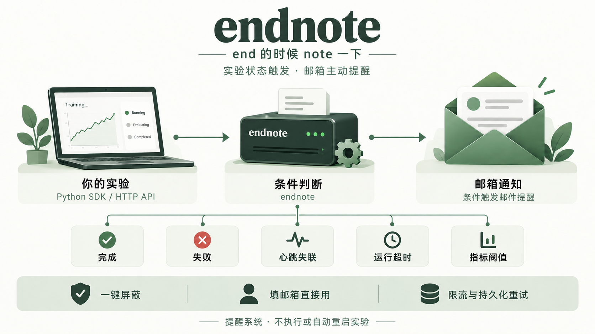

# endnote

**end 的时候 note 一下。** 为实验和后台任务提供条件触发的邮件提醒。

[打开网页直接使用](https://am.matterswarm.com/endnote/)：填收件邮箱、选择条件、创建提醒，下载脚本后运行：

~~~bash
python endnote-task.py -- python train.py
~~~

无需验证码，也无需手动申请密钥。脚本自动配置当前任务的访问凭据；请保管好下载的脚本，不要公开上传。创建后立即开始监控，请及时启动实验。

## 什么时候提醒

| 条件 | 行为 |
| --- | --- |
| 成功 | 实验正常结束后提醒 |
| 失败 | 实验报错或命令非零退出后提醒 |
| 失联 | 超过指定时间没有收到心跳时提醒，默认 5 分钟 |
| 运行超时 | 达到你选择的运行时长时提醒 |
| 指标阈值 | 代码上报的指标满足规则时提醒 |

条件可以选择。正常心跳只上报状态，**不会每隔一分钟发邮件**。首次创建提醒会发送一封测试邮件，后续创建不重复发送绑定测试。

## 实验多了，怎么区分邮件

给任务取包含项目、模型、关键参数或轮次的名字，例如“图像分类 ResNet50 seed42 第3次”。默认标题：

~~~text
[endnote][成功] 图像分类 ResNet50 seed42 第3次 · #a1b2c3d4
[endnote][失败] 图像分类 ResNet50 seed99 第4次 · #e5f6a7b8
[endnote][中断] 图像分类 ResNet50 seed42 第3次 · #a1b2c3d4
~~~

标题里的“中断”表示超过阈值未收到心跳，不代表已经确认进程崩溃。正文写明失联阈值与最后心跳时间；超时写明运行时长上限，指标提醒写明命中的规则。

同名实验通过任务编号区分，正文包含完整任务 ID 和创建时间。本地技能会根据实际实验配置取名，复用时不用再逐项解释。已有任务采用旧默认模板时，也会自动使用新标题；自定义模板保留，可使用 $task_id 插入编号。

## 不想收到邮件怎么办

**每封邮件底部都有一键屏蔽链接。** 点击后，这个邮箱会加入全局黑名单：取消待发邮件、停止相关任务的提醒，任何人都不能再用接口向它发信。已交给邮件服务器的邮件无法撤回。

链接使用随机令牌，不在 URL 中暴露邮箱。请不要公开分享屏蔽链接。

## Python 命令行接入

Python 3.10+，只用标准库，无第三方运行依赖：

~~~bash
git clone https://github.com/hanhan761/endnote.git
cd endnote
python -m endnote.client run --email you@example.com --name "模型训练" -- python train.py
~~~

可将 email 保存到自己用户目录的 ~/.config/endnote/preferences.json，后续省略 --email；技能会复用已授权的默认邮箱，不重复询问。不要提交真实邮箱或私有配置到 Git。

实验命令在调用客户端的机器上执行；服务只接收事件，不执行你提交的命令。

## Python 指标提醒

~~~python
from endnote.client import Client

with Client().experiment(
    "模型训练",
    email="you@example.com",
    heartbeat_timeout=300,
    runtime_timeout=7200,
    rules=[{"metric": "loss", "op": "lt", "value": 0.01}],
) as run:
    # 在真实训练循环中主动上报指标
    run.metric(loss=0.005)
~~~

正常退出报告成功，异常退出报告失败。指标需要代码主动上报，客户端不解析日志。规则支持 gt、gte、lt、lte、eq；每条规则命中后提醒一次。自动心跳证明上报进程活着；要检测训练卡住，需要在实际关键步骤上报进展。

## HTTP API

基地址：https://am.matterswarm.com/endnote

直接创建：POST /v1/quick/tasks，无需鉴权，Content-Type: application/json：

~~~json
{
  "email": "you@example.com",
  "name": "模型训练",
  "notify_on": ["succeeded", "failed", "heartbeat_timeout"],
  "heartbeat_timeout": 300,
  "runtime_timeout": null,
  "rules": []
}
~~~

返回 id、task_key、status。客户端自动保存 task_key；自写 HTTP 客户端需要私下保存它，并在当前任务的请求中发送 Authorization: Bearer TASK_KEY。

| 方法与路径 | 用途 |
| --- | --- |
| POST /v1/quick/tasks | 按邮箱直接创建提醒，无需验证 |
| POST /v1/tasks/{id}/events | 上报当前任务事件 |
| GET /v1/tasks/{id} | 查看当前任务条件、状态、通知 |
| DELETE /v1/tasks/{id} | 删除当前任务及待发通知 |
| GET /health | 查看服务健康状态 |

事件示例：

~~~json
{"event_id":"heartbeat-001","type":"heartbeat"}
{"event_id":"epoch-001","type":"metric","metrics":{"loss":0.005}}
{"event_id":"finished-001","type":"succeeded"}
~~~

失败用 failed，取消用 cancelled。不同事件使用不同 event_id，重试沿用原 ID。结束后不能恢复运行，重跑需要新任务。不同任务访问凭据隔离，即使邮箱相同也不能访问其他任务。

heartbeat_timeout 为 30–86400 秒，runtime_timeout 为 30–2592000 秒或 null。notify_on 支持 succeeded、failed、heartbeat_timeout、runtime_timeout；指标规则独立设置。公开任务名称仅允许文字、数字、空格、括号和连字符，最多 60 字符；指标名称使用字母、数字和下划线，不以数字开头。

HTTP 400 表示参数不正确，401/403 表示凭据无效、邮箱已屏蔽或网页来源不允许，404 表示任务不可访问，409 表示已结束，429 表示达到限额。请求体最多 16 KiB，不开放跨域浏览器调用。

已有账号的 /v1/tasks、账号管理接口仍保留兼容；直接使用流程不需要它们。

## 限制、隐私与资源

公开直接使用：每邮箱每天最多创建 3 个任务、尝试发送 3 封邮件，每 IP 每小时最多创建 3 个任务；首次测试和失败重试也计入发送次数。使用固定邮件模板，不接受任意邮件正文或发件人。全站还有创建、发信和队列上限。

心跳正常时不发邮件。成功、失败和运行超时各提醒一次；失联恢复后可重新布防，两次失联提醒至少间隔 15 分钟。已结束的任务和通知保留 30 天。不要在任务名称和指标中提交秘密或敏感数据。

通知状态 pending 表示待发，sent 表示 SMTP 已接受，dead 表示重试耗尽，blocked 表示被屏蔽。sent 不保证进入收件箱，请检查垃圾邮件。达到发送限额时可能延后。

服务使用 Python 标准库和 SQLite，不使用 GPU，不为每个任务启动独立进程。endnote 负责提醒，不负责恢复实验；服务本身或网络故障时，通知可能延迟。同一机器同时运行实验与提醒服务时，整机掉线需要独立外部监控。

## Codex 技能与自行部署

将 [skills/endnote](skills/endnote) 复制到 ~/.codex/skills/endnote，使用 $endnote 接入提醒。已授权的本机邮箱自动复用。

自行托管请看 [部署文档](deploy/README.md)。开发检查：

~~~bash
python -m unittest discover -s tests -v
~~~

[MIT 许可证](LICENSE)。
